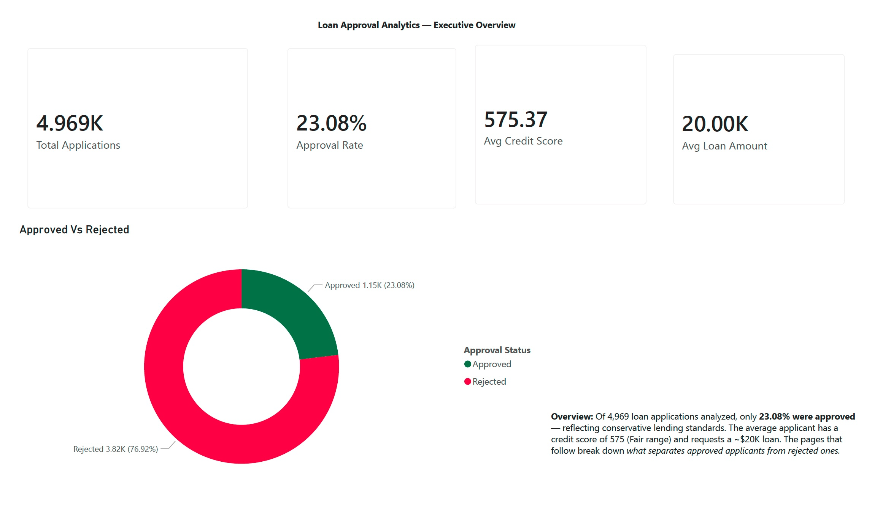
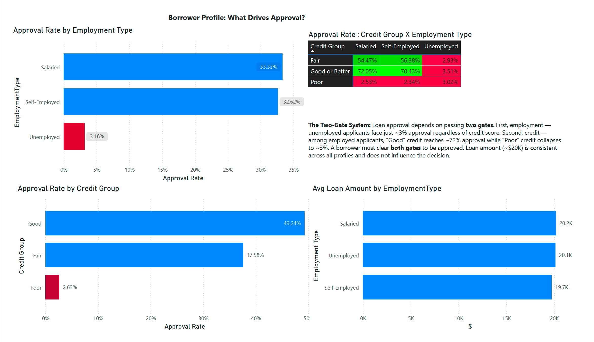
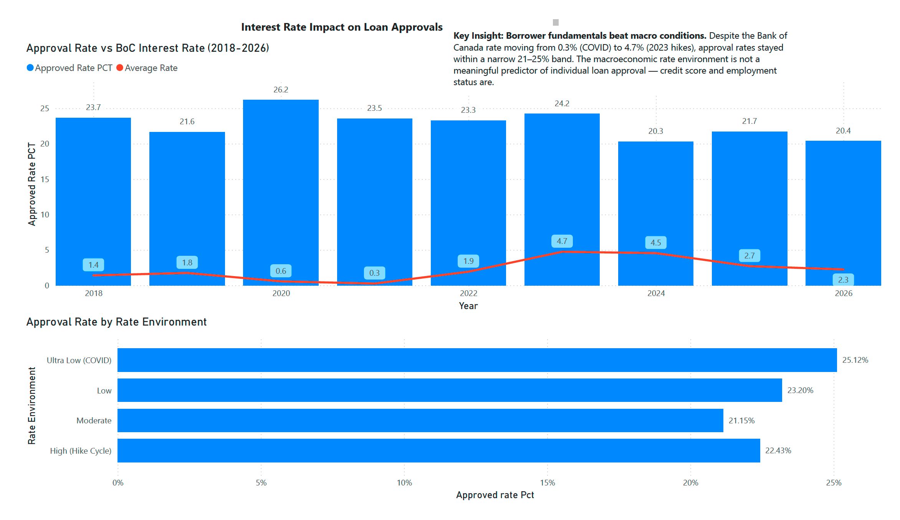

# Loan Approval Analytics & Interest Rate Impact

Analyzing what drives loan approval decisions, and whether Bank of Canada interest rates influence approval rates (2018–2026) and which specific group has to be focused to increase business. Built with **Python, SQL, and Power BI**.

---

## Project Overview

This project investigates two questions a Canadian bank's lending team would care about:

1. **What borrower characteristics drive loan approval?**
2. **Does the macroeconomic interest rate environment affect approval rates?**

The analysis covers ~5,000 loan applications joined with historical Bank of Canada overnight rate data.

---

## Tools & Tech Stack

| Stage | Tool |
|---|---|
| Data cleaning & date simulation | Python (pandas, NumPy) — Google Colab |
| Data modeling & analysis | SQL (SQLite / DB Browser) |
| Dashboard & visualization | Power BI |

---

## Key Findings

### 1. Loan approval follows a "Two-Gate System"
Approval depends on passing **two gates**:
- **Gate 1 — Employment:** Unemployed applicants face just **~3% approval**, regardless of credit score.
- **Gate 2 — Credit Score:** Among employed applicants, "Good" credit reaches **~72% approval**, while "Poor" credit collapses to **~3%**.

A borrower must clear **both** gates to be approved. Loan amount (~$20K) was consistent across all profiles and did not influence the decision.

### 2. Borrower fundamentals beat macro conditions
Despite the Bank of Canada rate swinging from **0.3% (COVID)** to **4.7% (2023 hikes)**, approval rates stayed within a narrow **21–25% band**. The interest rate environment is **not** a meaningful predictor of individual loan approval — credit and employment are.

---

## Dashboard Preview

The Power BI dashboard has three pages:







---

## Methodology

1. **Cleaned** raw loan data in Python — handled missing values via median/category imputation, removed invalid records.
2. **Simulated** loan issue dates (2018–2026) to enable time-series joins with interest rate data.
3. **Analyzed** in SQL — aggregations, `CASE` segmentation, and a `JOIN` between loans and monthly BoC rates.
4. **Visualized** in Power BI with KPI cards, a conditional-formatted matrix, and combo charts.

---

## Data Sources & Limitations

- **Loan data:** Public loan dataset (synthetic/anonymized).
- **Interest rates:** Bank of Canada overnight rate (series V39079) — real data.

> **Note:** Loan issue dates were synthetically assigned to enable time-series analysis. The weak rate-to-approval relationship reflects this simulation, not a real-world causal absence. The methodology demonstrates the analytical approach a bank would apply to real temporal data.

---


## Repository Structure

```
loan-approval-analytics/
├── data/          # Raw and cleaned datasets
├── sql/           # SQL queries + SQLite database
├── notebooks/     # Python data cleaning (Colab)
├── powerbi/       # Dashboard file (.pbix) + PDF export
├── screenshots/   # Dashboard page images
└── README.md
```
